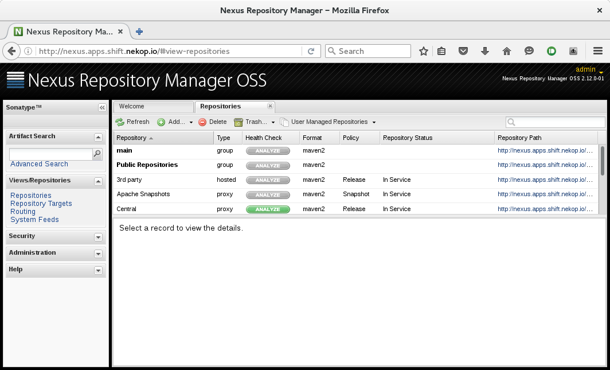
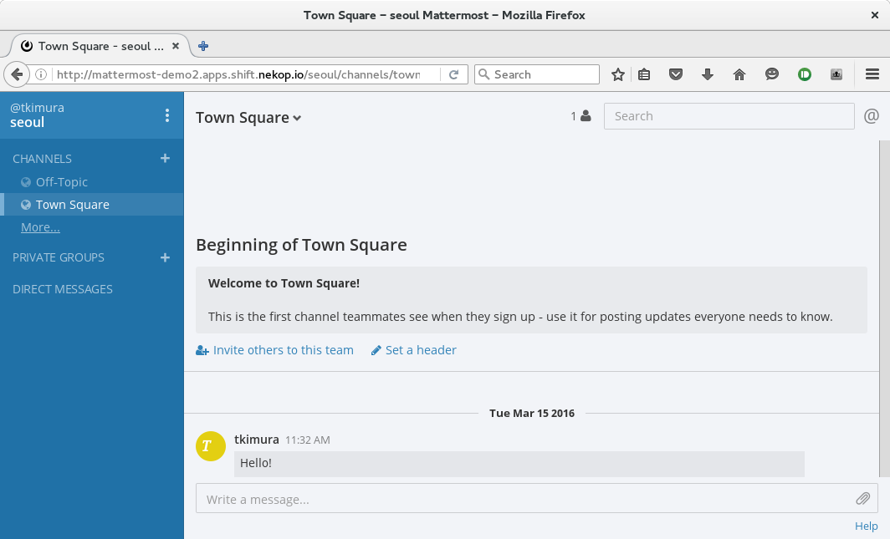
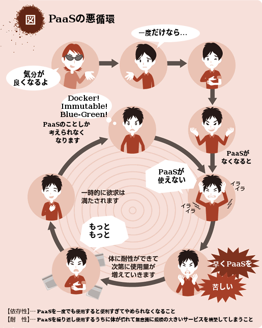

# Beginners Guide to OpenShift

# Takayoshi Kimura
## OpenShift / JBoss / WildFlyの中の人
### twitter: [@nekop](https://twitter.com/nekop)

## OpenShiftとは
<!-- .slide: data-background="images/openshift-jjug/openshift_reverse.png" data-background-size="512px" data-background-position="top right" -->

- Docker / KubernetesベースのオープンソースPaaS (Platform as a Service)ソフトウェア
- Docker / Kubernetesに、「簡単にみんなで使う」ために欠けている要素を追加したもの

## OpenShift v3
<!-- .slide: data-background="images/openshift-jjug/openshift_reverse.png" data-background-size="512px" data-background-position="top right" -->

- みんなで使えるDocker / Kubernetes
  - ユーザ管理、マルチテナント、ネットワークの提供
- Win/Mac/Linuxどれでも動くポータブルクライアント `"oc"` とWeb Console
- 改良版Dockerレジストリとイメージのバージョン管理
  - イメージのセキュリティアップデートと自動リビルド

## 基本的な機能

- Dockerイメージのビルド
- デプロイ

## Build

- Source-to-Image (s2i)
- Docker
- Custom

## OpenShiftのつかいかた

- コマンドラインでソースコードからビルドしてデプロイ
  - `oc new-app https://github.com/nekop/hello-sinatra`
  - `oc expose service hello-sinatra`

## OpenShiftのつかいかた

- ソースツリーだけではなくDockerイメージやDockerfileも丸投げ可
  - `oc new-app sonatype/nexus`
  - `oc expose service nexus`

## OpenShiftのつかいかた

- Webコンソールから

## OpenShiftのつかいかた

- テンプレートでデータベースやストレージ利用の指定
  - `oc new-app -f https://github.com/nekop/openshift-sandbox/blob/master/apps/mattermost/mattermost.yaml`

## まとめ

- Dockerを活用できる
- 社内の余っているコンピューティングリソースを有効活用できる
- アプリケーションを作るための準備がすぐできる
- 作ったアプリケーションをすぐ公開できる

## なぜPaaS？

- ITにおいて、アプリケーションが主であり価値を生み出す
  - インフラはアプリケーションを支えるものであり、直接価値を提供するものではない
- 全世界がPaaSに注目
  - アプリケーション開発者をアプリケーション開発にフォーカスさせるために
  - そしてアプリケーションを迅速に届けるために

## OpenShift Online v3

### 近日リリース予定！

## リンク

- [OpenShift documentation](https://docs.openshift.org/latest/welcome/index.html)
- [nekop's blog](http://nekop.hatenablog.com/)
- [めもめも](http://enakai00.hatenablog.com/)
- [OpenShiftの道具箱](http://jp-redhat.com/openeye_online/column/omizo/)
- [akubicharm's blog](http://akubicharm.hatenablog.com/)

