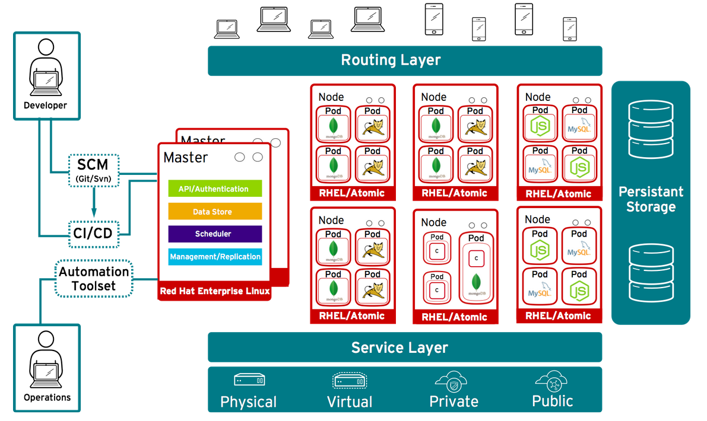
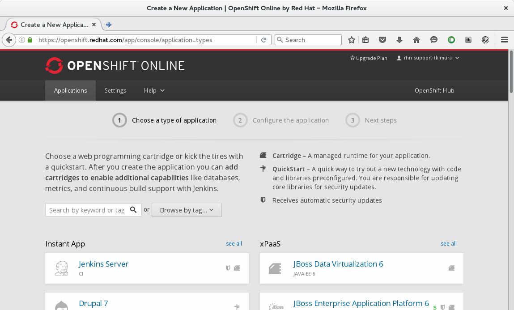
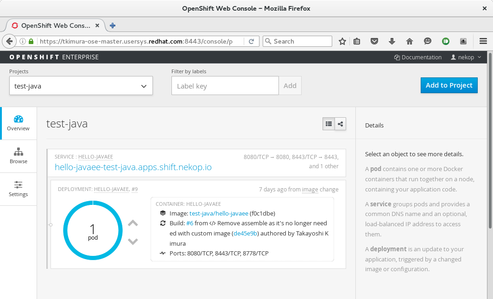
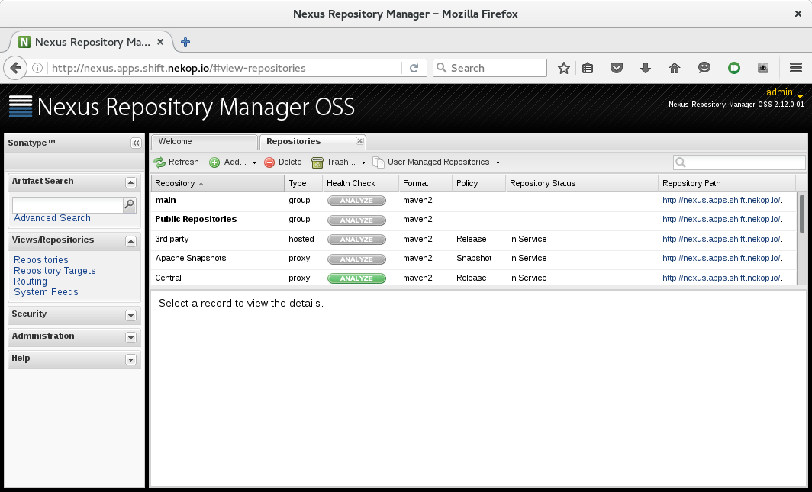
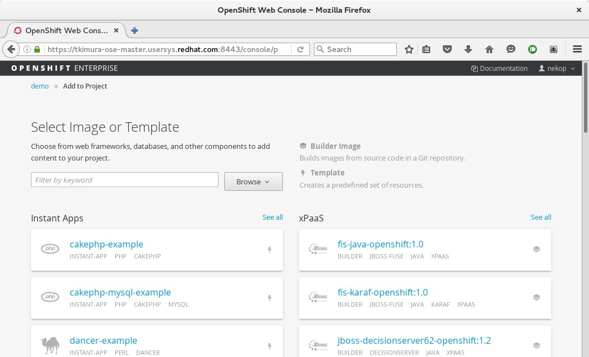
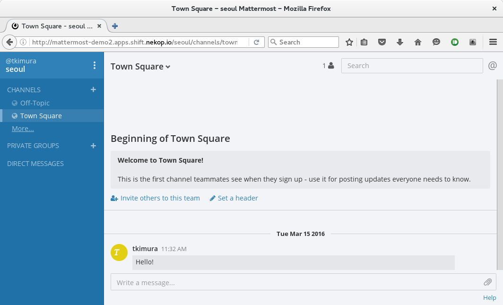
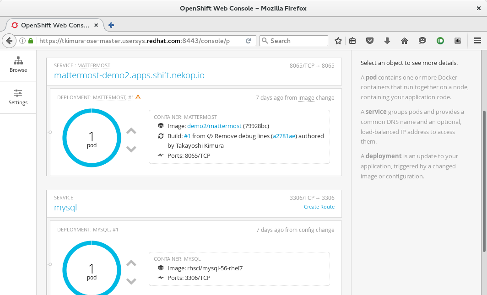
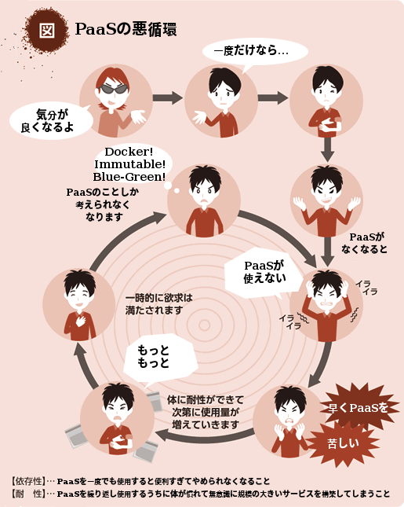

# OpenShiftでかんたんDocker PaaS

# Takayoshi Kimura
## OpenShift / JBoss / WildFlyの中の人
### twitter: @nekop

## OpenShiftとは
<!-- .slide: data-background="images/openshift-jjug/openshift_reverse.png" data-background-size="512px" data-background-position="top right" -->

- Docker / KubernetesベースのPaaS (Platform as a Service)ソフトウェア
- Docker / Kubernetesに、「簡単にみんなで使う」ために欠けている要素を追加したもの

## 対象ユーザおよび組織

- Dockerちゃんと使えていない、もっと気軽に使いたい
- Dockerのビルドとかデプロイを仕込むの面倒なので自動的にやってほしい
- プロジェクトごとのソフトウェアスタックをいちいちセットアップするの面倒
  - Javaのバージョン、アプリケーションサーバ、データベース...

## 対象ユーザおよび組織

- チャットやイシュートラッカーのような開発をアシストするソフトウェアを気軽にホストしたい
- CI / CDの基盤が欲しい
- 開発だと従量課金のリソースは使いづらいので、社内に開発でもガンガン使えるPaaS欲しい
- リソースをもっと集約してコンピューティングリソースを増やしたい

## OpenShift v3について話します

- Origin
  - 開発コミュニティ
- Online (v2)
  - Red Hatがホスティングするpublic PaaS
- Enterprise
  - オンプレミス向けPaaS製品
- Dedicated
  - Red HatがAWS上でホスティングするEnterprise

## OpenShift Online (v2)

- Dockerではないバージョン, RHEL 6ベース
- 3ギアまで無料
  - 1ギア = 1 CPU, 512 MB mem, 1GB disk
- これはこれで便利
- クライアントコマンドが `"rhc"`
  - v3は `"oc"`
- v3はもうちょっと待って

## Docker
<!-- .slide: data-background="images/openshift-jjug/docker-logo-dark-trans.png" data-background-size="256px" data-background-position="top right" -->

- VMより軽量なコンテナ
- ポータブルなイメージフォーマットと共有サービス
- セットアップガイド、インストールガイドの不要な世界
- 「ほぼセットアップ済み」ソフトウェアの流通

## Docker
<!-- .slide: data-background="images/openshift-jjug/docker-logo-dark-trans.png" data-background-size="256px" data-background-position="top right" -->

- 基本LinuxなのでWin/MacではVMでLinuxを利用するしかない
  - セットアップが手間
  - VMが必要なくなるDockerを使うためにVMが必要

## Kubernetes
<!-- .slide: data-background="images/openshift-jjug/k8s-logo-dark-trans.png" data-background-size="256px" data-background-position="top right" -->

- Docker + クラウドコンピューティング
- コンピューティングリソースを集約して最適化
- ローリングアップデートなど、柔軟なコンテナのデプロイ
- モニタリング

## OpenShift v3
<!-- .slide: data-background="images/openshift-jjug/openshift_reverse.png" data-background-size="512px" data-background-position="top right" -->

- みんなで使えるDocker / Kubernetes
  - ユーザ管理、マルチテナント、ネットワークの提供
- Win/Mac/Linuxどれでも動くポータブルクライアント `"oc"` とWeb Console
- 改良版Dockerレジストリとイメージのバージョン管理
- セットアップ簡単、スモールスタート可能

## 開発者から見たOpenShift

- Java EEアプリケーションを無料でデプロイできる数少ないPaaS
- 個人マシンにRDBMSとかセットアップする面倒がなくなる
  - アプリケーション開発者にインフラセットアップさせたら負け
- 重たいコンパイル、テスト、デプロイなどのワークロードは個人マシンや特定マシンではなく、リソースに余裕のあるクラスタへ投げて最適化したい

## 開発者から見たOpenShift

- 便利なアプリを作ったので公開する場所が欲しい
- 開発に必要なイシュートラッカーなどのツールをホストしたい
- プロジェクトの増援部隊に環境をすぐにセットアップして渡したい
- 開発者レベルでは従量課金クラウドは自由に使えない、社内のコンピューティングリソースを有効活用したい

## OpenShiftのつかいかた

- コマンドラインでソースコードからビルドしてデプロイ
  - `oc new-app https://github.com/nekop/hello-javaee`
  - `oc expose service hello-javaee`

## OpenShiftのつかいかた

- ソースツリーだけではなくDockerイメージやDockerfileも丸投げ可
  - `oc new-app sonatype/nexus`
  - `oc expose service nexus`

## OpenShiftのつかいかた

- Webコンソールから

## OpenShiftのつかいかた

- テンプレートでデータベースやストレージ利用の指定
  - `oc new-app -f https://github.com/nekop/openshift-sandbox/blob/master/apps/mattermost/mattermost.yaml`

## まとめ

- Dockerを活用できる
- 社内の余っているコンピューティングリソースを有効活用できる
- アプリケーションを作るための準備がすぐできる
- 作ったアプリケーションをすぐ公開できる

## なぜPaaS？

- ITにおいて、アプリケーションが主であり価値を生み出す
  - インフラはアプリケーションを支えるものであり、直接価値を提供するものではない
- 全世界がPaaSに注目
  - アプリケーション開発者をアプリケーション開発にフォーカスさせるために
  - そしてアプリケーションを迅速に届けるために

## OpenShift Online v3

### 近日リリース予定！

## リンク

- [OpenShift documentation](https://docs.openshift.org/latest/welcome/index.html)
- [nekop's blog](http://nekop.hatenablog.com/)
- [めもめも](http://enakai00.hatenablog.com/)
- [OpenShiftの道具箱](http://jp-redhat.com/openeye_online/column/omizo/)
- [akubicharm's blog](http://akubicharm.hatenablog.com/)

